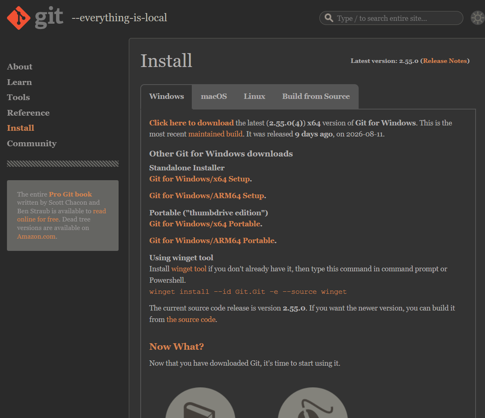

# Guía del Laboratorio 03

Documentación del trabajo colaborativo en GitHub para la materia de Diseño de Interfaces de Programación Avanzado.

## Sobre el proyecto

Explicación del flujo de trabajo con repositorios remotos, forks, clones e issues.

### Herramientas que uso

- **Git** para el control de versiones
- **GitHub** para el repositorio remoto
- **Visual Studio Code** como editor[cite: 2]

## Pasos para la contribución

1. Hacer un fork del repositorio en GitHub[cite: 2]
2. Ejecutar `git clone` en la terminal para descargarlo[cite: 2]
3. Crear una rama secundaria para realizar los cambios[cite: 2]

## Avance del laboratorio

- [x] Crear un fork del repositorio[cite: 2]
- [x] Reportar un problema mediante un Issue[cite: 2]
- [ ] Enviar una propuesta mediante Pull Request[cite: 2]

## Enlaces útiles

- [Guía oficial de Markdown](https://www.markdownguide.org/)
- [Mi perfil de GitHub](https://github.com/larrycarrion-ops)

## Captura de mi trabajo



## Comandos que más uso

Para ver el estado del repositorio uso `git status`[cite: 2].

```bash
git add .
git commit -m "Actualiza la documentación"
git push origin main
```

| Comando         | Que hace                       |
| --------------- | ------------------------------ |
| git clone       | Descarga el repositorio remoto |
| git checkout -b | Crea y cambia de rama          |
| git push        | Sube los cambios al remoto     |

---

### 2. Enlace en el `README.md` principal

Añade este enlace al final de tu archivo `README.md` principal[cite: 2]:

```markdown
## Documentación adicional

Para revisar la guía del laboratorio 03, consulta nuestra [Guía de trabajo](docs/GUIA.md)
```

- [Guia del proyecto](docs/GUIA.md)
